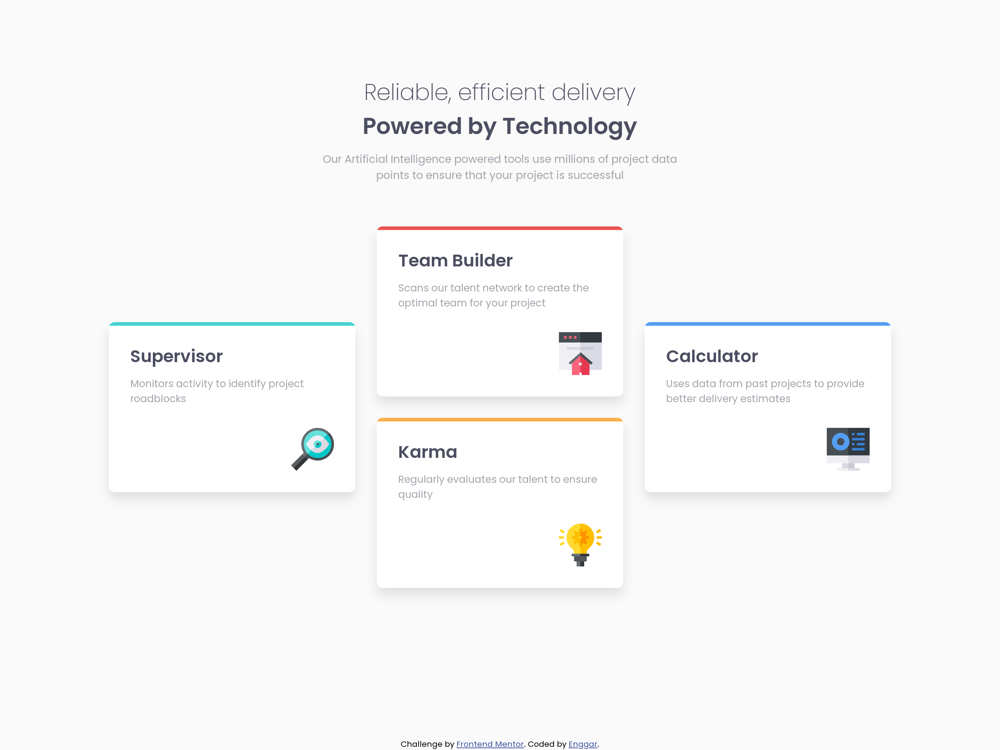

<h1 align="center">Four Card Feature Section</h1>

   Solution for a challenge from  <a href="https://www.frontendmentor.io/" target="_blank">frontendmentor.io</a>.

  <h3>
    <a href="https://fylo-dark.onrender.com/">
      Demo
    </a>
     | 
    <a href="https://www.frontendmentor.io/solutions/layout-using-grid-and-flexbox-y_aBMUWbg">
      Solution
    </a>
     | 
    <a href="https://www.frontendmentor.io/challenges/fylo-dark-theme-landing-page-5ca5f2d21e82137ec91a50fd">
      Challenge
    </a>
  </h3>

<!-- TABLE OF CONTENTS -->

## Table of Contents

-   [Overview](#overview)
    -   [Built With](#built-with)
-   [The Challenge](#the-challenge)
-   [Contact](#contact)

<!-- OVERVIEW -->

## Overview

### Built With

<!-- This section should list any major frameworks that you built your project using. Here are a few examples.-->

-   Semantic HTML5 markup
-   CSS Flexbox and Grid
-   BEM naming
-   SCSS
-   NPM

## The challenge

Users should be able to:

-   View the optimal layout for the site depending on their device's screen size
-   See hover states for all interactive elements on the page

## Contact

-   GitHub : [@nggar](https://github.com/nggar)
-   Gmail : jihandokoengg@gmail.com
